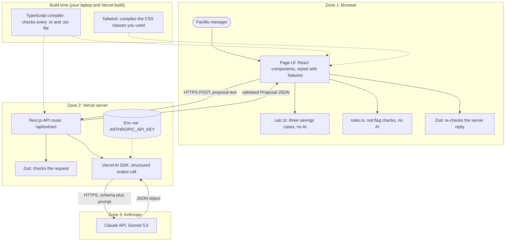
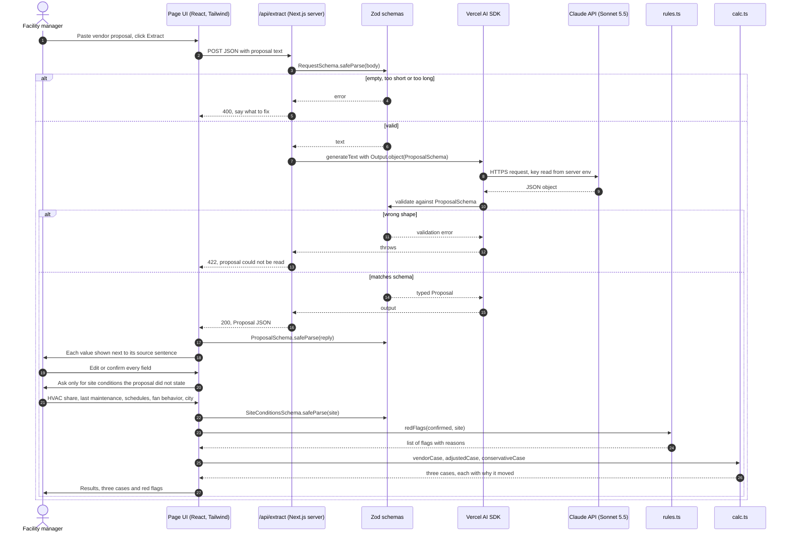
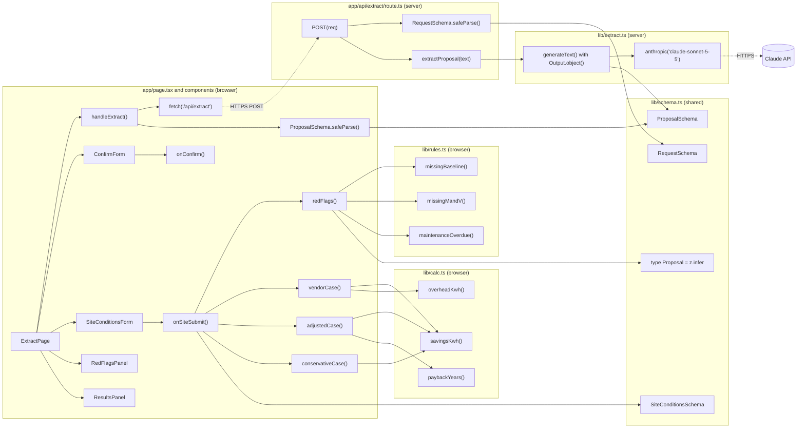

# 03 · Architecture

Rendered version with styled diagrams: the live page at https://claude.ai/artifact/6yvbGQNTdywkKist2s5S7f (a PDF export was made in planning but is not in this repo). The Mermaid source below renders in GitHub, Obsidian and VS Code.

## 1. Position: where each piece lives

Three runtime zones plus build time. Each zone box is a trust boundary: anything that crosses into a zone is checked before it's used. The API key lives only in the server zone.



Solid arrows carry data at runtime. Dotted arrows are build-time checks or configuration that never travel over the network.

## 2. Roles: what each piece does and why it's here

| Piece | Position | Role | What it does here | Why it was chosen | Talks to |
|---|---|---|---|---|---|
| Next.js (App Router) | Browser and server | Framework | Serves the page and hosts `/api/extract` in one project | Server route keeps the key off the browser without a separate Express server | Browser over HTTPS; AI SDK in the same process |
| React | Browser | UI components | Paste box, confirm form, results panel, form state | Comes with Next.js; confirm step needs editable fields tied to state | Next.js, calc.ts, Zod |
| Tailwind CSS | Build | Styling | Turns utility classes into one small CSS file | Consistent, professional look fast; design tokens go in `@theme` | React markup, build time only |
| TypeScript | Build | Checks your code | Flags wrong types, misspelled fields, unhandled null before the app runs | Catches your own mistakes; `z.infer` ties types to the schema | Every file, build time |
| Zod | Browser and server | Checks data at runtime | Validates the request, the model's output, and the reply the browser gets | Model output is untrusted input | API route, AI SDK, page |
| Vercel AI SDK | Server | Model client | `generateText` with `Output.object({ schema })` returns a typed object | Structured output and validation built in; one-line model switch | API route, Anthropic provider, Zod |
| Claude API (Sonnet 5.5) | External | The AI step | Reads messy proposal text; returns values and the source sentence for each | Strong at documents; about 1 cent a run ($2 in, $10 out per million tokens) | AI SDK only, over HTTPS |
| calc.ts | Browser | Deterministic math | Three cases, overhead, net kWh, payback | No AI touches the number behind a $15K to $30K decision | Confirm form, results panel |
| rules.ts | Browser | Red flag rules | Checks for missing baseline, M&V, weather adjustment, device power, overdue maintenance | Plain, testable rules; where field knowledge lives in code | Confirm form, results panel |
| Vercel hosting | Server | Deploy and secrets | Builds, serves HTTPS, stores the key as an environment variable | Free Hobby tier, deploys from GitHub, gives the live URL | GitHub, running app |

## 3. Sequence: one request, end to end

The happy path runs down the middle. The two `alt` boxes are where the app stops instead of guessing.



### The same request in plain words

1. **The manager pastes a proposal.** React holds the text in state. Nothing has left the laptop yet.
2. **The page sends it to the server.** A `fetch` POST to `/api/extract`. The browser never talks to Anthropic, so it never needs the key.
3. **Zod checks the request.** Empty, too short or oversized text is rejected before any API call costs money. The route never logs the proposal text.
4. **The AI SDK calls Claude** with the prompt and the schema, using the key from the server's environment.
5. **Zod checks the model's answer.** Wrong shape: the SDK throws and the route returns 422.
6. **The browser re-checks and shows sources.** Each number sits next to its sentence; missing values say "Not stated."
7. **A human confirms every value.** This is the check Zod can't do: 8% read from a proposal that says 18% is well-formed but wrong.
8. **The app asks only for what it couldn't find:** HVAC share, maintenance, whether the units run on schedules, whether the fans slow down or shut off, city.
9. **Red flag rules run** in rules.ts.
10. **Plain math produces three cases** in calc.ts, each adjustment shown as an editable assumption.

## 4. Call graph: which function calls which

Boxes are files. Arrows point from caller to callee. Dotted arrows cross the network. `lib/schema.ts` sits in the middle because both browser and server import it.



The graph shows three of the six rules and a subset of calc calls to stay readable; the full lists are in `02_Specification.md`.

## 5. Checks: what each layer catches and misses

| Check | Where | When | Catches | Misses | Lens |
|---|---|---|---|---|---|
| TypeScript | Build | Before the app runs | My own mistakes: wrong type, misspelled field, unhandled null | Anything the model returns | Measure |
| Zod on the request | Server | Every request | Empty, too short or oversized input | Text that isn't a proposal | Manage |
| Zod on the model output | Server | Every response | Missing fields, text where a number belongs, out-of-range percent | A well-formed wrong number | Measure, Manage |
| Source sentence per value | Browser | Before confirm | Invented values, since there's no sentence to show | Relies on the person reading it | Map, Manage |
| Human confirmation | Browser | Before any math | Misread numbers like 8% for 18% | A rushed click-through | Manage |
| Red flag rules | Browser | After confirm | Missing baseline, M&V, weather adjustment, device power | Problems no rule was written for | Map, Manage |
| Deterministic math | Browser | After confirm | AI drift in the final figure (no AI runs here) | Wrong confirmed inputs | Measure |

## 6. File layout

```
app/
  page.tsx                 ExtractPage, state, fetch
  api/extract/route.ts     POST handler, server only
components/
  ConfirmForm.tsx          values + source sentences
  SiteConditionsForm.tsx   only what the AI couldn't find
  RedFlagsPanel.tsx        what the vendor left out
  ResultsPanel.tsx         three cases, payback
lib/
  schema.ts                Zod schemas + Proposal type
  extract.ts               AI SDK call to Claude
  calc.ts                  three cases, unit tested
  rules.ts                 red flag rules, unit tested
.env.local                 ANTHROPIC_API_KEY (never commit)
docs/
  prompt_log.md            Prompt Log
  04_Trustworthy_AI_Lens.md  Map, Measure, Manage
```

## 7. Saying it in 30 seconds

- **Position:** The browser never holds the key. One Next.js API route talks to Claude.
- **AI:** Claude only reads the proposal. It returns numbers with the sentence each came from.
- **Checks:** TypeScript checks my code. Zod checks the model's shape. A person checks the model's facts.
- **Math:** The final numbers come from plain TypeScript, so the same inputs always give the same answer. Red flags show what the vendor left out.

## 8. Security notes

- `.env.local` is in `.gitignore`. The proposal text is never logged; only its length and the status code. On Vercel the key is a server environment variable, never prefixed `NEXT_PUBLIC_`.
- The extraction prompt tells Claude to ignore instructions inside the proposal (prompt injection).
- Request length cap limits cost per call; set a monthly spend limit in the Anthropic Console and keep auto-reload off.
